# mycat 分库分表

## MyCat概述

### MyCat的作用
    1. 实现数据库的读写分离
        通过Mycat可以自动实现写数据时操作主数据库，读数据时操作从数据库，这样能有效地减轻数据库压力，也能减轻IO压力。
        如果有了Mycat，客户端直接连接Mycat，可以实现读写分离，如果主机出现问题，会自动切换到从服务器上。

    2. 数据分片
        <1> 水平切分(横向切分)
                简而言之，将一张表里面的数据分散到多个表里面(分表)

        <2> 垂直切分(纵向切分)
                简而言之，将一个数据库中的多张表分散到多个数据库中(分库)

    3. 总而言之，性能有瓶颈实现读写分离，容量有瓶颈实现分库分表

    4. 能整合MySQL，Oracle，DB2, Redis等数据库

### MyCat原理
    Mycat通过拦截用户发送过来的SQL语句，并对其做一些特定的分析，如：分片分析、路由分析、读写分离分析、缓存分析等，然后
    将该SQL发到后端的真实数据库，并将返回的结果做完处理后，最终返回给用户

    简而言之，拦截sql→解析sql→数据资源管理→数据源分配→请求/响应→结果整合


### Mycat安装
    1. 依赖jdk，需要安装jdk
        yum install -y java-1.8.0-openjdk-devel.x86_64

    2. 下载相关的Mycat资源包，解压

        wget http://dl.mycat.io/1.6-RELEASE/Mycat-server-1.6-RELEASE-20161028204710-linux.tar.gz

        tar –zxvf Mycat-server-1.6-RELEASE-20161028204710-linux.tar.gz

    3.执行命令启动与关闭
        cd mycat/bin
        ./mycat start       启动
        ./mycat stop        关闭

    4. 登录mycat命令行，使用mysql的命令行工具来操作的（需要在mysql中创建用户）：
        mysql -umycat -p -P8066 -h127.0.0.1
	    mycat默认数据访问端口是8066

### 配置文件分析
    1. server.xml
        <1> 配置序列生成方式
        <2> 配置mycat逻辑数据库，表 分片
        <3> 配置mycat的访问账户和密码

    2. schema.xml
        用于配置的逻辑数据库的映射、表、分片规则、数据结点及真实的数据库信息

    3. rule.xml
        定义分片规则

## 配置读写分离
    1. 在配置读写分离之前，首先需要实现数据库的主从复制，因为它是基于主从复制的，可参考mysql笔记中配置的主从复制

    2. 配置mycat的server.xml文件

``` xml
<?xml version="1.0" encoding="UTF-8"?>

<!DOCTYPE mycat:server SYSTEM "server.dtd">
<mycat:server xmlns:mycat="http://io.mycat/">
		<system>
		<property name="useSqlStat">0</property>  							<!-- 1为开启实时统计、0为关闭 -->
		<property name="useGlobleTableCheck">0</property>  					<!-- 1为开启全加班一致性检测、0为关闭 -->
		<!-- 0为本地文件方式，1为数据库方式，2为时间戳序列方式-->
		<property name="sequnceHandlerType">2</property>

		<property name="processorBufferPoolType">0</property>

		<property name="handleDistributedTransactions">0</property>

		<property name="useOffHeapForMerge">1</property>

		<property name="memoryPageSize">1m</property>

		<property name="spillsFileBufferSize">1k</property>

		<property name="useStreamOutput">0</property>
		<property name="systemReserveMemorySize">384m</property>
		<property name="useZKSwitch">true</property>
	</system>
	<user name="root">
		<property name="password">root</property>
		<property name="schemas">mycatdb</property>
	</user>
	<user name="user">
		<property name="password">user</property>
		<property name="schemas">mycatdb</property>
		<property name="readOnly">true</property>
	</user>

</mycat:server>

```

    3. 配置schema.xml

``` xml
<?xml version="1.0"?>
<!DOCTYPE mycat:schema SYSTEM "schema.dtd">
<mycat:schema xmlns:mycat="http://io.mycat/">

	<schema name="mycatdb" checkSQLschema="false" sqlMaxLimit="100" dataNode="dn1">
		
	</schema>
	<!-- 配置真实的数据库名称-->	
	<dataNode name="dn1" dataHost="localhost1" database="mytest" />
	
	<!-- 配置具体数据库连接信息 如分库分表-->	
	<dataHost 	name="localhost1" 
				maxCon="1000" 
				minCon="10" 
				balance="3"
				writeType="0" 
				dbType="mysql" 
				dbDriver="native" 
				switchType="1"  
				slaveThreshold="100">
		<heartbeat>select user()</heartbeat>
		<writeHost host="hostM3307" url="localhost:3307" user="root" password="root">
			<!-- 配置写数据库下面的读数据库 主节点下面的从节点 -->
			<readHost host="hostS3308" url="localhost:3308" user="root" password="root" />
		</writeHost>
	</dataHost>
</mycat:schema>
```

    4. 重新启动mycat
        ./mycat restart

    5. 验证是否成功配置
		<1> 确保已经打开2台mysql服务,并验证2台机器 主从复制已经起作用

		<2> sqlyog连接mycat，默认数据访问端口是8066

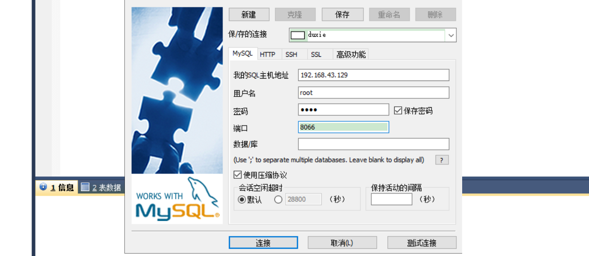

		<3> 创建dept表，插入数据，各个数据库都会存在

```sql
		create table dept(
			id int(10) primary key AUTO_INCREMENT,
			name varchar(20)
		);

		insert into dept(id,name) values(1,"development");
```
 
		<4> 修改从库数据 添加3308数据信息
		
		<5> SQL语句验证，每执行一次 数据来自不同的数据库 说明实现负载均衡 请求转发
			select * from dept
			

## 分库分表

### 概述
	1. 为什么需要分库呢？
		在没有进行分库的操作，随着业务需求的增加，增删改查开销也越来越大，另外一个数据库的数据是无法进行分布式部署的
		一台服务器的资源有限，数据库的处理能力遇到瓶颈

	2. 分库分表存在的问题？
		<1> 事务的问题。分库后，表分到了不同的数据库，实现统一的事务管理比较困难

		<2> 跨库跨表的join问题。分库分表后，逻辑关联很强的数据划分在不同的表和库中，表的关联受到限制

		<3> 额外的数据管理负担和数据运算压力。分库分表后，会增加额外的运算


### 垂直分库
	1. 概念：将一个数据库中的表分为多个数据库。一个数据库里面的多个表分散到多个数据库里面(分库)

	2. 实现垂直分库
		<1> 准备数据库环境，创建数据库表
			1) 在mysql实现的3307的数据库（主库）中创建test01库，并创建表customer

``` sql	
create table customer(
id int auto_increment,
name varchar(200),
primary key(id)
);
```

			2)  在3308数据库（从库）创建test02库，创建 orders、orders_detail、dict_order_type

```sql

-- 订单表 rows:600万
create table orders(
   id int auto_increment,
   order_type int,
   customer_id int,
   amount decimal(10,2),
   PRIMARY KEY(id)
);

-- 订单详情表 rows：600万
create table orders_detail(
   id INT AUTO_INCREMENT,
   detail varchar(2000),
   order_id int,
   PRIMARY KEY(id)
);

-- 订单状态字典表 rows：20
create table dict_order_type(
   id INT AUTO_INCREMENT,
   order_type varchar(200),
   PRIMARY KEY(id)
);

```
		<3> 配置mycat中的配置文件schema.xml

```xml

<?xml version="1.0"?>
<!DOCTYPE mycat:schema SYSTEM "schema.dtd">
<mycat:schema xmlns:mycat="http://io.mycat/">

	<schema name="mycatdb" checkSQLschema="false" sqlMaxLimit="100">
		<!--配置test01-->
		 <table name="customer" dataNode="dn1"></table>		
		<!--配置test02-->
		<table name="orders" dataNode="dn1"></table>
		<table name="orders_details" dataNode="dn1"></table>
		<table name="dict_order_type" dataNode="dn1"></table>
	</schema>
	<!-- 配置真实的数据库名称-->	
	<dataNode name="dn1" dataHost="localhost1" database="test01"/>
	<dataNode name="dn2" dataHost="localhost2" database="test02"/>
	
	<!-- 配置具体数据库连接信息 如分库分表-->	
	<dataHost 	name="localhost1" 
				maxCon="1000" 
				minCon="10" 
				balance="2"
				writeType="0" 
				dbType="mysql" 
				dbDriver="native" 
				switchType="1"  
				slaveThreshold="100">
		<heartbeat>select user()</heartbeat>
		<writeHost host="hostM3307" url="localhost:3307" user="root" password="root">
		</writeHost>
	</dataHost>

	<dataHost 	name="localhost2" 
				maxCon="1000" 
				minCon="10" 
				balance="2"
				writeType="0" 
				dbType="mysql" 
				dbDriver="native" 
				switchType="1"  
				slaveThreshold="100">
		<heartbeat>select user()</heartbeat>
		<writeHost host="hostM3308" url="localhost:3308" user="root" password="root">
		</writeHost>
	</dataHost>
</mycat:schema>

```
		<4> server.xml的配置与读写分离保持一致

```xml

<?xml version="1.0" encoding="UTF-8"?>

<!DOCTYPE mycat:server SYSTEM "server.dtd">
<mycat:server xmlns:mycat="http://io.mycat/">
		<system>
		<property name="useSqlStat">0</property>  <!-- 1为开启实时统计、0为关闭 -->
		<property name="useGlobleTableCheck">0</property>  <!-- 1为开启全加班一致性检测、0为关闭 -->

		<property name="sequnceHandlerType">2</property>
		<property name="processorBufferPoolType">0</property>
		<property name="handleDistributedTransactions">0</property>
		<property name="useOffHeapForMerge">1</property>
		<property name="memoryPageSize">1m</property>
		<property name="spillsFileBufferSize">1k</property>
		<property name="useStreamOutput">0</property>
		<property name="systemReserveMemorySize">384m</property>
		<property name="useZKSwitch">true</property>
	</system>
	<user name="root">
		<property name="password">root</property>
		<property name="schemas">mycatdb</property>
	</user>

</mycat:server>

```

		<5> 测试垂直拆分

			直接连接数据mycatdb,查看表中是否都有我们配置的表

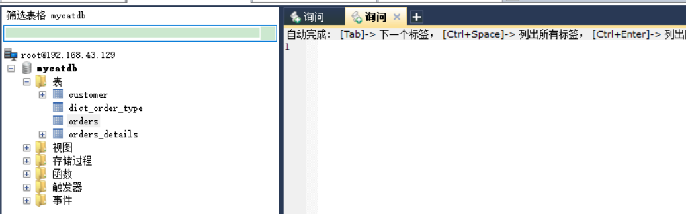

### 普通水平拆分
	1. 概念：将一张表里面的数据分散到多个表里面(分表)

	2. 实现水平拆分
		<1> 准备工作：实现要求就是将一张表的数据拆分到多个表中，那么我们就需要实现在3307和3308中都有一张共同的表，比如
					将orders进行拆分，那么这两个数据库中都需要有orders表

			1) 在3307的test01中创建orders表

```sql
create table orders(
   id int auto_increment,
   order_type int,
   customer_id int,
   amount decimal(10,2),
   PRIMARY KEY(id)
);
```
		<2> 配置schema.xml

```xml

	<?xml version="1.0"?>
<!DOCTYPE mycat:schema SYSTEM "schema.dtd">
<mycat:schema xmlns:mycat="http://io.mycat/">

	<schema name="mycatdb" checkSQLschema="false" sqlMaxLimit="100">
		<!--配置3307和3308中的orders表，并指定规则-->
		 <table name="orders" dataNode="dn1,dn2" rule="my_rule"></table>		
	</schema>
	<!-- 配置真实的数据库名称-->	
	<dataNode name="dn1" dataHost="localhost1" database="test01"/>
	<dataNode name="dn2" dataHost="localhost2" database="test02"/>
	
	<!-- 配置具体数据库连接信息 如分库分表-->	
	<dataHost 	name="localhost1" 
				maxCon="1000" 
				minCon="10" 
				balance="2"
				writeType="0" 
				dbType="mysql" 
				dbDriver="native" 
				switchType="1"  
				slaveThreshold="100">
		<heartbeat>select user()</heartbeat>
		<writeHost host="hostM3307" url="localhost:3307" user="root" password="root">
		</writeHost>
	</dataHost>

	<dataHost 	name="localhost2" 
				maxCon="1000" 
				minCon="10" 
				balance="2"
				writeType="0" 
				dbType="mysql" 
				dbDriver="native" 
				switchType="1"  
				slaveThreshold="100">
		<heartbeat>select user()</heartbeat>
		<writeHost host="hostM3308" url="localhost:3308" user="root" password="root">
		</writeHost>
	</dataHost>
</mycat:schema>

```
		<3> 配置rule.xml，server.xml与之前保持一致

```xml

<?xml version="1.0" encoding="UTF-8"?>
<!DOCTYPE mycat:rule SYSTEM "rule.dtd">
<mycat:rule xmlns:mycat="http://io.mycat/">
	<tableRule name="my_rule">
		<rule>
			<columns>customer_id</columns>
			<algorithm>mod-log</algorithm>
		</rule>
	</tableRule>

	<tableRule name="rule1">
		<rule>
			<columns>id</columns>
			<algorithm>fun1</algorithm>
		</rule>
	</tableRule>'

	<tableRule name="mod-long">
		<rule>
			<columns>id</columns>
			<algorithm>mod-long</algorithm>
		</rule>
	</tableRule>

	<function name="mod-long" class="io.mycat.route.function.PartitionByMod">
		<!-- how many data nodes -->
		<property name="count">2</property>
	</function>

	<function name="mod-log"
			  class="io.mycat.route.function.PartitionByMod">
		<property name="count">2</property><!-- 要分片的数据库节点数量，必须指定，否则没法分片 -->
	</function>
	
</mycat:rule>

```

		<4> 测试水平拆分效果
			1) 当我们插入数据是两个数据库的orders表有不同的数据插入

```sql

insert into orders(id,order_type,customer_id,amount) values(1,101,100,100100);
INSERT INTO orders(id,order_type,customer_id,amount) VALUES(2,101,100,100300);
INSERT INTO orders(id,order_type,customer_id,amount) VALUES(3,101,101,120000);
INSERT INTO orders(id,order_type,customer_id,amount) VALUES(4,101,101,103000);
INSERT INTO orders(id,order_type,customer_id,amount) VALUES(5,102,101,100400);
INSERT INTO orders(id,order_type,customer_id,amount) VALUES(6,102,100,100020);

```
			2) 当我们在读写分离中写数据的数据库中插入数据，执行上面sql

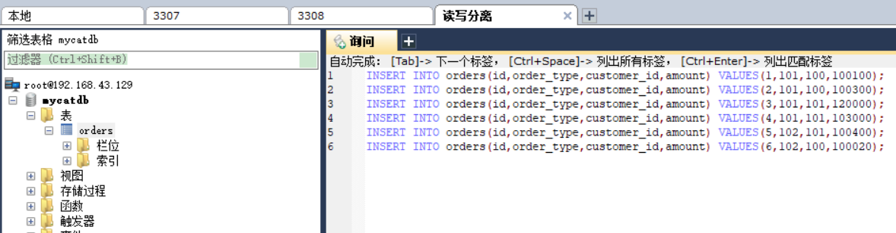

			3) 查看3307中的orders表可以发现

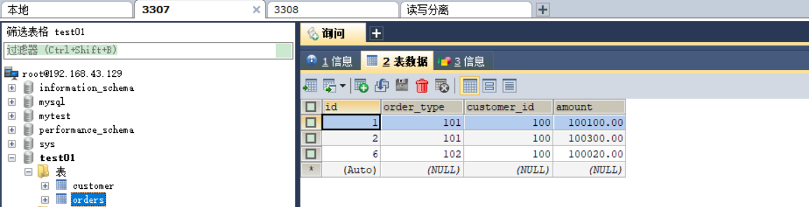

			4) 查看3308中的orders表可以发现

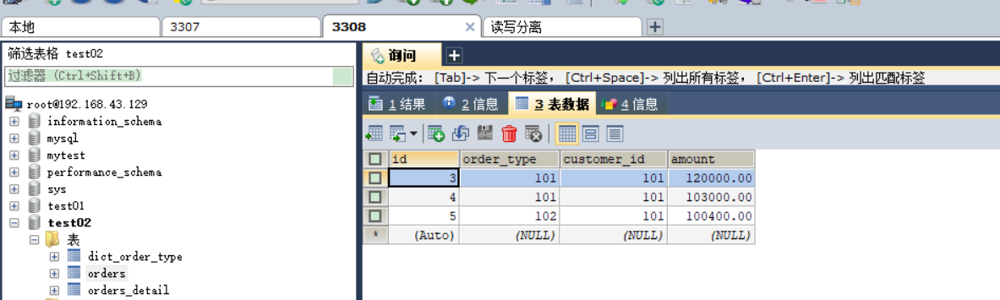


### 水平-ER表实现
	1. 实现要求：在3307和3308中都需要有orders_detail详情表。当我们实现插入数据时，两个数据库中有不同的数据插入

	2. 配置实现
		<1> 在3307中创建orders_detail表

```sql

create table orders_detail(
   id INT AUTO_INCREMENT,
   detail varchar(2000),
   order_id int,
   PRIMARY KEY(id)
);

```

		<2> 配置schema.xml

```xml

<?xml version="1.0"?>
<!DOCTYPE mycat:schema SYSTEM "schema.dtd">
<mycat:schema xmlns:mycat="http://io.mycat/">

	<schema name="mycatdb" checkSQLschema="false" sqlMaxLimit="100">
		<!--配置3307和3308中的orders表，并指定规则-->
		 <table name="orders" dataNode="dn1,dn2" rule="my_rule">
				<!--配置3307和3308中的orders_detail表-->
				<childTable name="orders_detail" primaryKey="id" joinKey="order_id" parentKey="id"></childTable>
		 </table>		
	</schema>
	<!-- 配置真实的数据库名称-->	
	<dataNode name="dn1" dataHost="localhost1" database="test01"/>
	<dataNode name="dn2" dataHost="localhost2" database="test02"/>
	
	<!-- 配置具体数据库连接信息 如分库分表-->	
	<dataHost 	name="localhost1" 
				maxCon="1000" 
				minCon="10" 
				balance="2"
				writeType="0" 
				dbType="mysql" 
				dbDriver="native" 
				switchType="1"  
				slaveThreshold="100">
		<heartbeat>select user()</heartbeat>
		<writeHost host="hostM3307" url="localhost:3307" user="root" password="root">
		</writeHost>
	</dataHost>

	<dataHost 	name="localhost2" 
				maxCon="1000" 
				minCon="10" 
				balance="2"
				writeType="0" 
				dbType="mysql" 
				dbDriver="native" 
				switchType="1"  
				slaveThreshold="100">
		<heartbeat>select user()</heartbeat>
		<writeHost host="hostM3308" url="localhost:3308" user="root" password="root">
		</writeHost>
	</dataHost>
</mycat:schema>

```
		<3> 重启mycat，如果有错误可以去到mycat/logs/wrapper.log查看信息

		<4> 测试
			1) 在读写分离的mycatdb中执行下列sql

```sql

insert into orders_detail(id,detail,order_id) values(1,'detail1',1);
INSERT INTO orders_detail(id,detail,order_id) VALUES(2,'detail1',2);
INSERT INTO orders_detail(id,detail,order_id) VALUES(3,'detail1',3);
INSERT INTO orders_detail(id,detail,order_id) VALUES(4,'detail1',4);
INSERT INTO orders_detail(id,detail,order_id) VALUES(5,'detail1',5);
INSERT INTO orders_detail(id,detail,order_id) VALUES(6,'detail1',6);

```
			2) 查看3307中的orders_detail

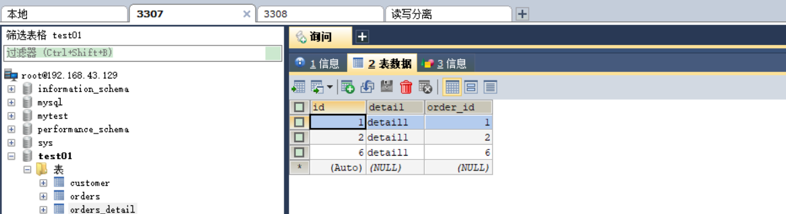

			3) 查看3307中的orders_detail

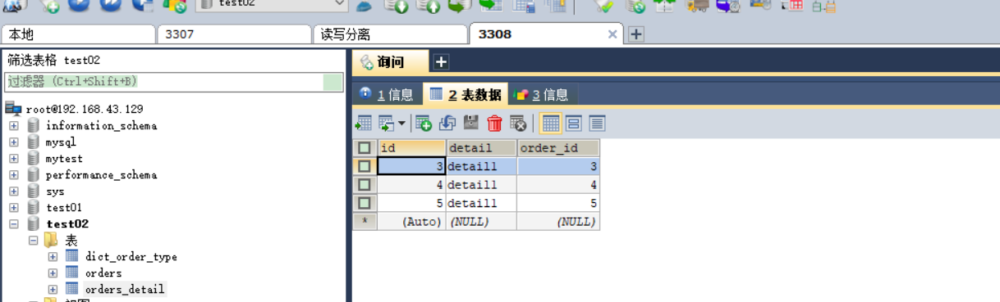

			4) 查看其中一表联表内容

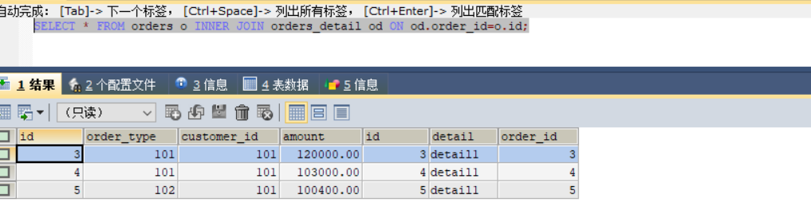


### 全局表配置

	1. 配置全局表的要求：设定为全局的表，会直接复制给每个数据库一份，所有写操作也会同步给多个库。所以全局表一般不能是
						大数据表或者更新频繁的表，一般是字典表或者系统表为宜。
		
		* 实现效果：当我们在读写分离的写的机子上写入数据时，在两个3307和3308都会存在同样的数据，当我们去获取插入的数
					据时，会随机从一个服务器的表中获取

	2. 实现配置
		<1> 在3307的test01中创建表dict_order_type
 
```sql
create table dict_order_type(
   id INT AUTO_INCREMENT,
   order_type varchar(200),
   PRIMARY KEY(id)
);
```

		<2> 配置schema.xml

```xml

	<?xml version="1.0"?>
<!DOCTYPE mycat:schema SYSTEM "schema.dtd">
<mycat:schema xmlns:mycat="http://io.mycat/">

	<schema name="mycatdb" checkSQLschema="false" sqlMaxLimit="100">
		<!--配置3307和3308中的orders表，并指定规则-->
		 <table name="orders" dataNode="dn1,dn2" rule="my_rule">
				<!--配置3307和3308中的orders_detail表-->
				<childTable name="orders_detail" primaryKey="id" joinKey="order_id" parentKey="id"></childTable>
		 </table>	
		 <!--配置全局表-->
		 <table name="dict_order_type" dataNode="dn1,dn2" type="global" ></table>

	</schema>
	<!-- 配置真实的数据库名称-->	
	<dataNode name="dn1" dataHost="localhost1" database="test01"/>
	<dataNode name="dn2" dataHost="localhost2" database="test02"/>
	
	<!-- 配置具体数据库连接信息 如分库分表-->	
	<dataHost 	name="localhost1" 
				maxCon="1000" 
				minCon="10" 
				balance="2"
				writeType="0" 
				dbType="mysql" 
				dbDriver="native" 
				switchType="1"  
				slaveThreshold="100">
		<heartbeat>select user()</heartbeat>
		<writeHost host="hostM3307" url="localhost:3307" user="root" password="root">
		</writeHost>
	</dataHost>

	<dataHost 	name="localhost2" 
				maxCon="1000" 
				minCon="10" 
				balance="2"
				writeType="0" 
				dbType="mysql" 
				dbDriver="native" 
				switchType="1"  
				slaveThreshold="100">
		<heartbeat>select user()</heartbeat>
		<writeHost host="hostM3308" url="localhost:3308" user="root" password="root">
		</writeHost>
	</dataHost>
</mycat:schema>

```
		<3> 重启mycat

		<4> 测试全局表

			1) 在读写分离的写的服务器中写入数据

```sql

insert into dict_order_type(id,order_type) values(101,'type1');
insert into dict_order_type(id,order_type) values(102,'type2');

```
			2) 查看3307中的数据

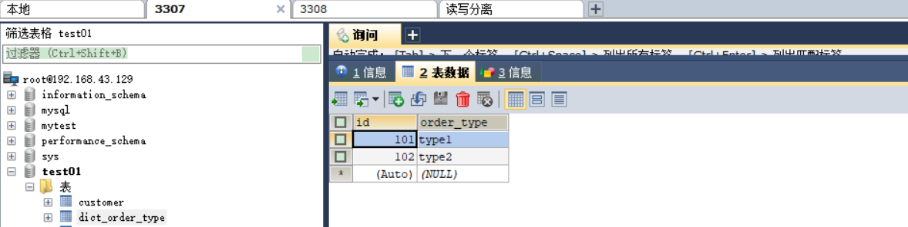

			3) 查看3308中的数据

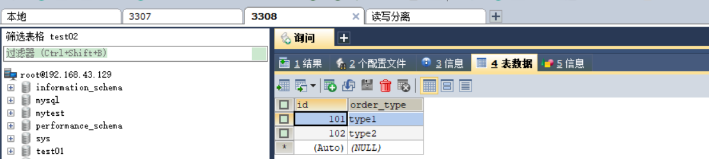

			4) 结果：查看结果可知，两张表中都有插入的所有数据


## Mycat中的全局序列号

### 全局序列号概述
	1. 全局序列号的配置分类
		<1> 本地文件方式

		<2> 时间戳的方式

		<3> 数据库方式（次方式推荐使用）
	
	2. 控制三种方式的属性
		在server.xml中sequnceHandlerType属性可以对其进行控制。0为本地文件方式，1为数据库方式，2为时间戳序列方式

 
### 配置本地文件方式

	1. 配置server.xml

```xml
<?xml version="1.0" encoding="UTF-8"?>

<!DOCTYPE mycat:server SYSTEM "server.dtd">
<mycat:server xmlns:mycat="http://io.mycat/">
		<system>
		<property name="useSqlStat">0</property>  <!-- 1为开启实时统计、0为关闭 -->
		<property name="useGlobleTableCheck">0</property>  <!-- 1为开启全加班一致性检测、0为关闭 -->

		<!--指定为0表示使用本地文件的方式-->
		<property name="sequnceHandlerType">0</property>
		<property name="processorBufferPoolType">0</property>
		<property name="handleDistributedTransactions">0</property>
		<property name="useOffHeapForMerge">1</property>
		<property name="memoryPageSize">1m</property>
		<property name="spillsFileBufferSize">1k</property>
		<property name="useStreamOutput">0</property>
		<property name="systemReserveMemorySize">384m</property>
		<property name="useZKSwitch">true</property>
	</system>
	<user name="root">
		<property name="password">root</property>
		<property name="schemas">mycatdb</property>
	</user>

</mycat:server>

```

	2. 配置schema.xml

```xml

<?xml version="1.0"?>
<!DOCTYPE mycat:schema SYSTEM "schema.dtd">
<mycat:schema xmlns:mycat="http://io.mycat/">

	<schema name="mycatdb" checkSQLschema="false" sqlMaxLimit="100">
		<!--配置3307和3308中的orders表，并指定规则-->
		 <table name="orders" dataNode="dn1,dn2" rule="my_rule">
				<!--配置3307和3308中的orders_detail表-->
				<childTable name="orders_detail" primaryKey="id" joinKey="order_id" parentKey="id"></childTable>
		 </table>	
		
		<table name="dept" dataNode="dn1,dn2" rule="mod-long"></table>

	</schema>
	<!-- 配置真实的数据库名称-->	
	<dataNode name="dn1" dataHost="localhost1" database="test01"/>
	<dataNode name="dn2" dataHost="localhost2" database="test02"/>
	
	<!-- 配置具体数据库连接信息 如分库分表-->	
	<dataHost 	name="localhost1" 
				maxCon="1000" 
				minCon="10" 
				balance="2"
				writeType="0" 
				dbType="mysql" 
				dbDriver="native" 
				switchType="1"  
				slaveThreshold="100">
		<heartbeat>select user()</heartbeat>
		<writeHost host="hostM3307" url="localhost:3307" user="root" password="root">
		</writeHost>
	</dataHost>

	<dataHost 	name="localhost2" 
				maxCon="1000" 
				minCon="10" 
				balance="2"
				writeType="0" 
				dbType="mysql" 
				dbDriver="native" 
				switchType="1"  
				slaveThreshold="100">
		<heartbeat>select user()</heartbeat>
		<writeHost host="hostM3308" url="localhost:3308" user="root" password="root">
		</writeHost>
	</dataHost>
</mycat:schema>

```
	3. 在mycatdb中添加表,注意如果需要在连接mycat的数据库中创建表那么就必须在schema.xml中进行配置（配置table）

```sql

create table dept(
	id int(10) primary key AUTO_INCREMENT,
	name varchar(50)
);

```
	4. 配置sequence_conf.properties
		用来维护主键信息如果想要每个表生成的主键连续，可以在sequence_conf.properties配置，当前表的生成值，一般将
		Global替换为自己对应的前缀即可。

	5. 测试
		<1> 在mycatdb中插入数据

```sql

insert into dept(id, name) values (next value for MYCATSEQ_GLOBAL,'zhangsan');

```
		<2> 读取数据是使用MYCATSEQ_GLOBAL获取，因为我们使用的是如下：

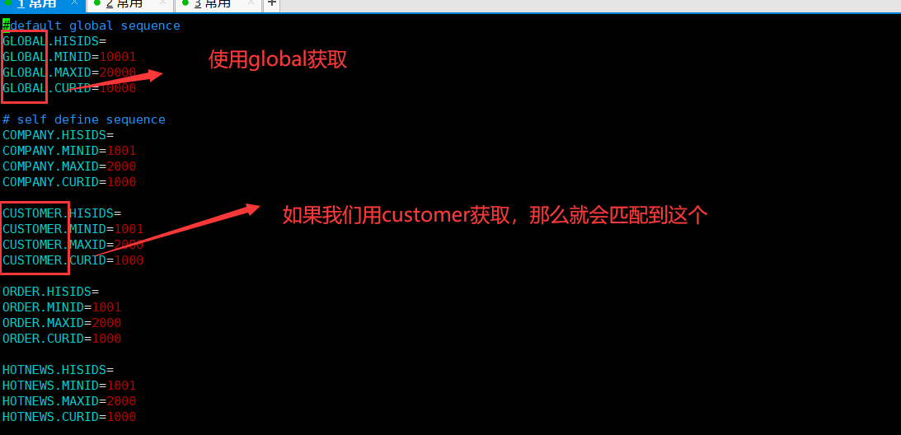

		<3> 获取数据如下所示，可以发现id已经是我们在sequence_conf.properties设置的开始的

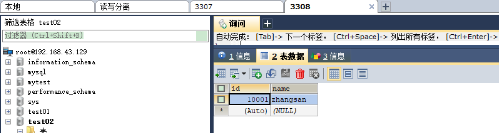

### 配置时间戳方式

	1. 在本地方式的前提下，配置server.xml
		只需要将sequnceHandlerType属性设置为2即可，即表示使用时间戳方式进行配置

```xml

<property name="sequnceHandlerType">0</property>

```	
	2. 修改表的主键
		此种方式需要主键设置为string格式，这是由于时间戳的长度是较长的的。一般设置为30即可。此种方式的缺点就是
		id太长

		将mycatdb以及3307和3308的id的类型都转换为varchar

```sql
alter table dept modify column id varchar(30);
```

	3. 重启mycat，查看id修改的效果即可.查看先可知修改成功

```sql
insert into dept(id, name) values (next value for MYCATSEQ_GLOBAL,'123');
```

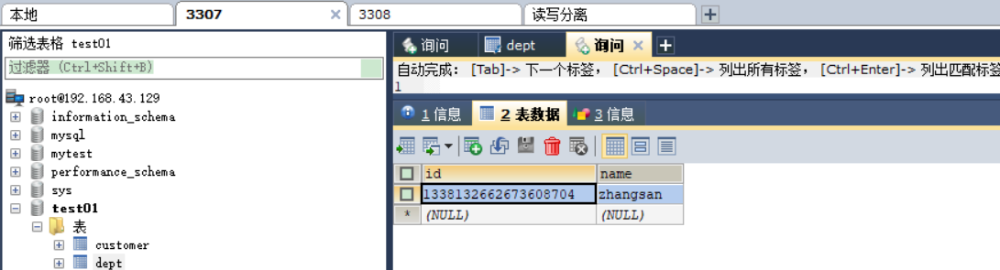

### 配置数据库的方式(推荐使用此种方式)

	1. 数据库方式生成主键ID，不是采用数据库的主键自增，而是mycat利用mysql数据库生成一个主键

	2. 配置实现
		<1> 配置server.xml

			只需要将sequnceHandlerType属性设置为1即可，即表示使用数据库方式进行配置

```xml

	<property name="sequnceHandlerType">1</property>

```
		<2> 在数据库中创建一张表，三个函数，比如在3307下进行创建

```sql

DROP TABLE IF EXISTS MYCAT_SEQUENCE;

CREATE TABLE MYCAT_SEQUENCE (NAME VARCHAR(50) NOT NULL,current_value INT NOT NULL,increment INT NOT NULL DEFAULT 1,
PRIMARY KEY(NAME)) ENGINE=INNODB DEFAULT CHARSET=utf8;
INSERT INTO MYCAT_SEQUENCE(NAME,current_value,increment) VALUES ("GLOBAL", 0, 100);

DROP FUNCTION IF EXISTS mycat_seq_currval;
DELIMITER //
CREATE FUNCTION mycat_seq_currval(seq_name VARCHAR(50)) RETURNS VARCHAR(64) CHARSET utf8
DETERMINISTIC
BEGIN
DECLARE retval VARCHAR(64);
SET retval="-999999999,null";
SELECT CONCAT(CAST(current_value AS CHAR),",",CAST(increment AS CHAR)) INTO retval FROM MYCAT_SEQUENCE WHERE NAME = seq_name;
RETURN retval;
END //
DELIMITER  ;

DROP FUNCTION IF EXISTS mycat_seq_setval;
DELIMITER //
CREATE FUNCTION mycat_seq_setval(seq_name VARCHAR(50),VALUE INTEGER) RETURNS VARCHAR(64) CHARSET utf8
DETERMINISTIC
BEGIN
UPDATE MYCAT_SEQUENCE
SET current_value = VALUE
WHERE NAME = seq_name;
RETURN mycat_seq_currval(seq_name);
END //
DELIMITER ;

DROP FUNCTION IF EXISTS mycat_seq_nextval;
DELIMITER //
CREATE FUNCTION mycat_seq_nextval(seq_name VARCHAR(50)) RETURNS VARCHAR(64) CHARSET utf8
DETERMINISTIC
BEGIN
UPDATE MYCAT_SEQUENCE
SET current_value = current_value + increment WHERE NAME = seq_name;
RETURN mycat_seq_currval(seq_name);
END //
DELIMITER ;


```
		<3> 配置sequence_db_conf.properties
			指定sequence相关配置在哪个节点上，例如我们在3307的test01上创建的生成主键的表，那么根据我们在schema.xml文
			件中的配置，对应的节点应该是dn1

		<4> 测试
			1) 首先我们需要将表的id字段的类型修改回int

			2) 在mycatdb中插入数据并在其他的地方3307查看效果

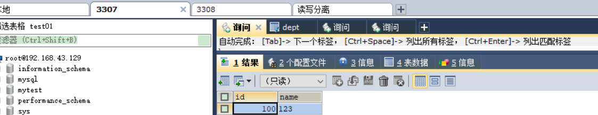


```sql

alter table dept modify column id int(11);

insert into dept(id, name) values (next value for MYCATSEQ_GLOBAL,'zhangsan');
select * from dept

```


	


