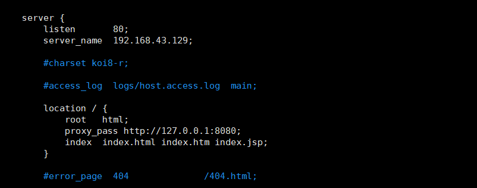
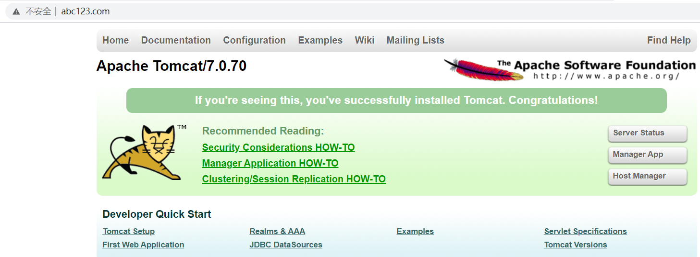
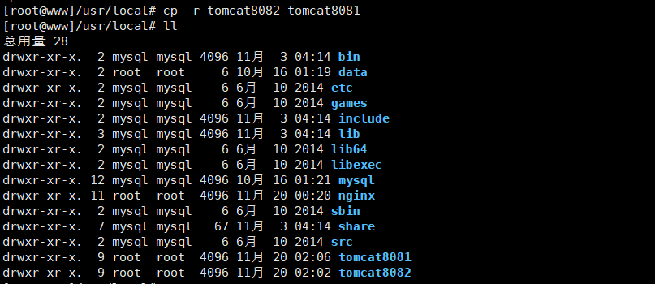
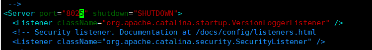
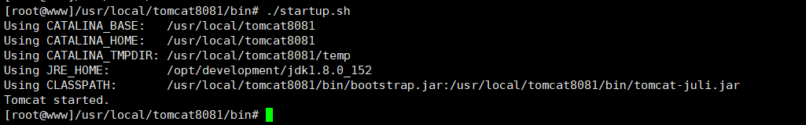
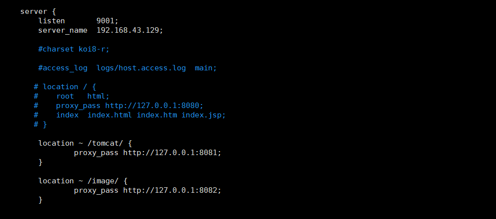

# Nginx

## Nginx安装（linux）

    1. 官网下载nginx。
        wget http://nginx.org/ nginx-1.12.2.tar.gz

    2. 安装pcre
        <1> 下载：wget http://downloads.sourceforge.net/project/pcre/pcre/8.37/pcre-8.37.tar.gz

        <2> 解压缩：tar -zxvf pcre-8.37.tar.gz

        <3> 进入pcre目录下执行./configure

        <4> 进入pcre目录下执行 make 和make install

        <5> 检查版本 pcre-config –-version

    3. 安装相关依赖
        yum -y install make zlib zlib-devel gcc-c++ libtool  openssl openssl-devel

    4. 安装nginx
        <1> 解压：tar -zxvf nginx-1.12.2.tar.gz

        <2> 进入nginx目录执行./configure

        <3> 进入nginx目录执行 make && make install

        <4> 进入下列目录: cd /usr/local/nginx/sbin

        <5> 执行./nginx

    5. 设置防火墙，访问nginx
        <1> firewall-cmd --list-all

        <2> 设置开放的服务或端口号
            firewall-cmd --add-service=http --permanent
            firewall-cmd --add-port=80/tcp --permanent
        
        <3> 重启防火墙  firewall-cmd --reload

    6. 完成安装后，直接浏览器访问IP地址默认端口80

    7. 注意：如果没有firewall命令，执行下列命令安装（firewall相关）
        <1> 安装防火墙 firewall： yum install firewalld

        <2> 重启防火墙 systemctl start firewalld

        <3> 查看防火墙状态 systemctl status firewalld

        <4> 查看防火墙开放端口 firewall-cmd --list-ports

## Nginx相关知识点概述
    1. server块中location指令的使用
        <1> 作用：该指令用于匹配 URL。

        <2> 样式：

```
    location [ = | ~ | ~* | ^~] uri {

    }

```

        <3> 介绍:
            (1) = ：用于不含正则表达式的 uri 前，要求请求字符串与 uri 严格匹配，如果匹配成功，就停止继续向下搜索并立即处理
                    该请求。

            (2) ~：用于表示 uri 包含正则表达式，并且区分大小写。
 
            (3) ~*：用于表示 uri 包含正则表达式，并且不区分大小写。

            (4) ^~：用于不含正则表达式的 uri 前，要求 Nginx 服务器找到标识 uri 和请求字符串匹配度最高的 location 后，立即
                    使用此 location 处理请求，而不再使用 location块中的正则 uri 和请求字符串做匹配。

                注意：如果 uri 包含正则表达式，则必须要有 ~ 或者 ~* 标识。


## Nginx实现相关配置

### Nginx配置访问tomcat服务器(反向代理服务器1)
    1. 需要实现的效果：使用 nginx 反向代理，访问 www.abc123.com 直接跳转到 192.168.43.129:8080

    2. 配置实现（虚拟机实现）
        <1> 在windows中启动一个tomcat，正常访问：192.168.43.129:8080 
            1) 在linux上安装好tomcat

            2) 开启防火墙
                * firewall-cmd --add-port=8080/tcp --permanent
                * firewall-cmd --reload

            3) 在windows上访问 http://192.168.43.129:8080

        <2> 编辑windows中的C:/windows/system32/drivers/etc/hosts文件
            * 添加 192.168.43.129  www.abc123.com 
 
        <3> 在nginx的nginx.conf中配置请求转发



        <4> 在windows浏览器中访问www.abc123.com，如下所示



### 反向代理服务器2

    1. 实现效果：
        使用 nginx 反向代理，根据访问的路径跳转到不同端口的服务中。
        其中nginx 监听端口为 9001，
            访问 http://127.0.0.1:9001/tomcat/ 直接跳转到 127.0.0.1:8081
            访问 http://127.0.0.1:9001/image/ 直接跳转到 127.0.0.1:8082

    2. 配置实现
        <1> 开启两个tomcat，一个端口为8081，一个端口8082
            1) 首先在/usr/local下复制两个tomcat，重命名为tomcat8081和tomcat8082



            2) 将tomcat8082的端口号修改
                * cd tomcat8082/conf

                * 编辑 vim server.xml




                * 按照上面步骤可以将8081的端口信息也进行修改
            
            3) 启动tomcat8082即可(注意需要将防火墙对应的端口8082打开)


            4) 同样的，启动8081(注意需要将防火墙对应的端口8081打开)



        <2> 准备相关目录资源文件
            1) 进入到8081中的webapp,创建tomcat文件夹，并在该文件夹下创建a.html文件

    

            2) 进入到8082中的webapp,创建image文件夹，并在该文件夹下创建b.html文件

        <3> 编辑nginx的配置文件
            1) vim nginx.conf

            2) 进行相关配置

 

        <4> 需要开放我们使用的端口9001，并重新启动nginx
            * firewall-cmd --add-port=9001/tcp --permanent
            * firewall-cmd --reload

        <5> 进行测试，在windows浏览器中访问
            http://192.168.43.129:9001/tomcat/a.html
            http://192.168.43.129:9001/image/b.html

 

 


### 负载均衡服务搭建
    1. 实现效果
        当在windows的浏览器中访问http://192.168.43.129/tomcat/a.html时，实现负载均衡效果，将请求
        平均到8081和8082中

    2. 配置实现
        


           


## Nginx 的基本配置文件

    1. 配置文件主要分为三个部分
        <1> 全局块（从第一行到到events块）之间的内容。
            * 主要会设置一些影响 nginx 服务器整体运行的配置指令，主要包括配置运行 Nginx 服务器的用户（组）、允许生成worker
              process 数，进程 PID 存放路径、日志存放路径和类型以及配置文件的引入等

        <2> events块
            * events 块涉及的指令主要影响 Nginx 服务器与用户的网络连接，常用的设置包括是否开启对多 work process下的网络连
              接进行序列化，是否允许同时接收多个网络连接，选取哪种事件驱动模型来处理连接请求，每个 word process 可以同时支
              持的最大连接数等。

        <3> http块（http块包括http全局块，和server块）
            1) http全局块
                http 全局块配置的指令包括文件引入、MIME-TYPE 定义、日志自定义、连接超时时间、单链接请求数上限等。

            2) server块
                每个 http 块可以包括多个 server 块，而每个 server 块就相当于一个虚拟主机。而每个 server 块也分为全server
                块，以及可以同时包含多个 locaton 块。
                
                * 全局server块：最常见的配置是本虚拟机主机的监听配置和本虚拟主机的名称或 IP 配置。

                * location块：
                    一个 server 块可以配置多个 location 块。
                    这块的主要作用是基于 Nginx 服务器接收到的请求字符串（例如 server_name/uri-string），对虚拟主机名称（也
                    可以是 IP 别名）之外的字符串（例如 前面的 /uri-string）进行匹配，对特定的请求进行处理。地址定向、数据缓
                    存和应答控制等功能，还有许多第三方模块的配置也在这里进行。


    2.详细配置文件如下

```bash
#配置worker进程运行用户 nobody也是一个linux用户，一般用于启动程序，没有密码
user  nobody;  
#配置工作进程数目，根据硬件调整，通常等于CPU数量或者2倍于CPU数量  具体干活的 处理网络事件
worker_processes  1;  

#配置全局错误日志及类型，[debug | info | notice | warn | error | crit]，默认是error
error_log  logs/error.log;  
#error_log  logs/error.log  notice;
#error_log  logs/error.log  info;

pid        logs/nginx.pid;  #配置进程pid文件 


###====================================================


#配置工作模式和连接数
events {
    worker_connections  1024;  #配置每个worker进程连接数上限，nginx支持的总连接数就等于worker_processes * worker_connections
}

###===================================================


#配置http服务器,利用它的反向代理功能提供负载均衡支持
http {
    #配置nginx支持哪些多媒体类型，可以在conf/mime.types查看支持哪些多媒体类型
    include       mime.types;  
    #默认文件类型 流类型，可以理解为支持任意类型
    default_type  application/octet-stream;  
    #配置日志格式 
    #log_format  main  '$remote_addr - $remote_user [$time_local] "$request" '
    #                  '$status $body_bytes_sent "$http_referer" '
    #                  '"$http_user_agent" "$http_x_forwarded_for"';

    #配置access.log日志及存放路径，并使用上面定义的main日志格式
    #access_log  logs/access.log  main;

    sendfile        on;  #开启高效文件传输模式
    #tcp_nopush     on;  #防止网络阻塞

    #keepalive_timeout  0;
    keepalive_timeout  65;  #长连接超时时间，单位是秒

    #gzip  on;  #开启gzip压缩输出
	
	###-----------------------------------------------
	

    #配置虚拟主机
    server {
        listen       80;  #配置监听端口
        server_name  localhost;  #配置服务名

        #charset koi8-r;  #配置字符集

        #access_log  logs/host.access.log  main;  #配置本虚拟主机的访问日志

		#默认的匹配斜杠/的请求，当访问路径中有斜杠/，会被该location匹配到并进行处理
        location / {
	    #root是配置服务器的默认网站根目录位置，默认为nginx安装主目录下的html目录
            root   html;  
	    #配置首页文件的名称
            index  index.html index.htm;  
        }		

        #error_page  404              /404.html;  #配置404页面
        # redirect server error pages to the static page /50x.html
        #error_page   500 502 503 504  /50x.html;  #配置50x错误页面
        
	#精确匹配
	location = /50x.html {
            root   html;
        }

		#PHP 脚本请求全部转发到Apache处理
        # proxy the PHP scripts to Apache listening on 127.0.0.1:80
        #
        #location ~ \.php$ {
        #    proxy_pass   http://127.0.0.1;
        #}

		#PHP 脚本请求全部转发到FastCGI处理
        # pass the PHP scripts to FastCGI server listening on 127.0.0.1:9000
        #
        #location ~ \.php$ {
        #    root           html;
        #    fastcgi_pass   127.0.0.1:9000;
        #    fastcgi_index  index.php;
        #    fastcgi_param  SCRIPT_FILENAME  /scripts$fastcgi_script_name;
        #    include        fastcgi_params;
        #}

		#禁止访问 .htaccess 文件
        # deny access to .htaccess files, if Apache's document root
        # concurs with nginx's one
        #
        #location ~ /\.ht {
        #    deny  all;
        #}
    }

	
	#配置另一个虚拟主机
    # another virtual host using mix of IP-, name-, and port-based configuration
    #
    #server {
    #    listen       8000;
    #    listen       somename:8080;
    #    server_name  somename  alias  another.alias;

    #    location / {
    #        root   html;
    #        index  index.html index.htm;
    #    }
    #}

	
	#配置https服务，安全的网络传输协议，加密传输，端口443，运维来配置
	#
    # HTTPS server
    #
    #server {
    #    listen       443 ssl;
    #    server_name  localhost;

    #    ssl_certificate      cert.pem;
    #    ssl_certificate_key  cert.key;

    #    ssl_session_cache    shared:SSL:1m;
    #    ssl_session_timeout  5m;

    #    ssl_ciphers  HIGH:!aNULL:!MD5;
    #    ssl_prefer_server_ciphers  on;

    #    location / {
    #        root   html;
    #        index  index.html index.htm;
    #    }
    #}
}

```